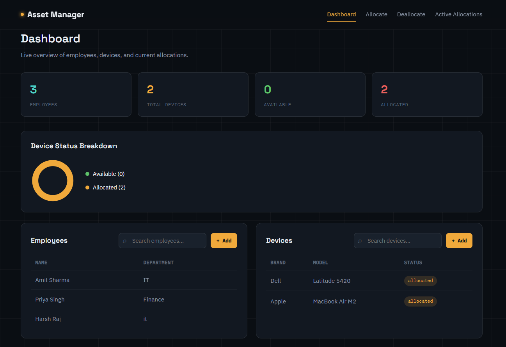
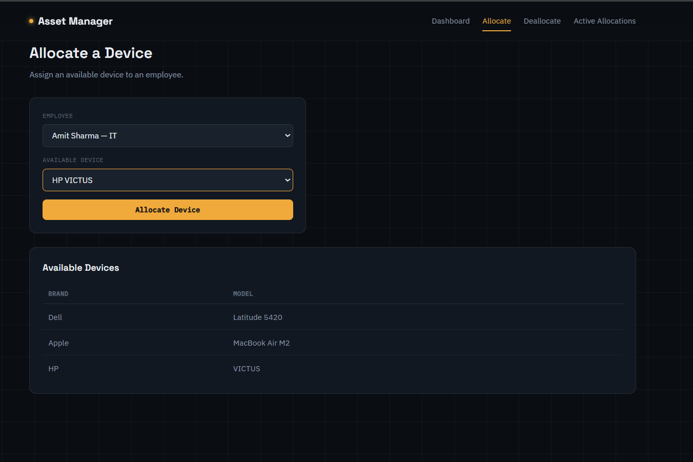
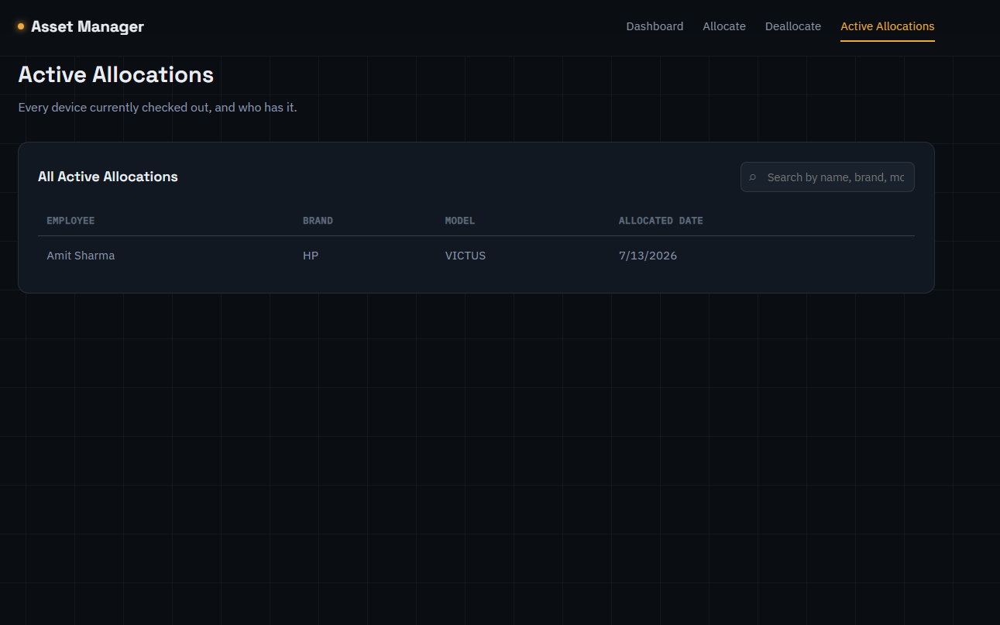

# 🖥️ Asset Management System

A full-stack IT asset tracking tool built with Node.js, Express, and MySQL — lets a company allocate, deallocate, and monitor devices assigned to employees, in real time.

**🔗 Live Demo:** [asset-management-txq4.onrender.com](https://asset-management-txq4.onrender.com)

> Note: the app runs on a free-tier server and may take 30–50 seconds to wake up on first load — that's normal, not a bug.

---

## ✨ Features

- 📊 **Live dashboard** — real-time counts of employees, devices, availability status, and a device status breakdown chart
- 🔄 **Allocate / Deallocate devices** — assign devices to employees and return them, with instant UI updates (no page reloads)
- 🔍 **Live search** — filter employees, devices, and allocation history as you type
- 📋 **Active allocations tracker** — see exactly who has what device and since when
- 🔔 **Toast notifications** — clear success/error feedback on every action
- 🎨 **Custom dark UI** — no frontend framework, hand-built with vanilla JS + EJS

## 🛠️ Tech Stack

| Layer | Technology |
|---|---|
| Backend | Node.js, Express 5 |
| Database | MySQL (via `mysql2`) |
| Templating | EJS |
| Frontend | Vanilla JavaScript, CSS |
| Hosting | Render (app) + Aiven (MySQL) |

## 📸 Screenshots

### Dashboard


### Allocate a Device


### Active Allocations

## 🗄️ Database Schema

```sql
CREATE TABLE employees (
  employee_id INT AUTO_INCREMENT PRIMARY KEY,
  name VARCHAR(255) NOT NULL,
  department VARCHAR(255)
);

CREATE TABLE devices (
  device_id INT AUTO_INCREMENT PRIMARY KEY,
  brand VARCHAR(255) NOT NULL,
  model VARCHAR(255) NOT NULL,
  status VARCHAR(50) DEFAULT 'available'
);

CREATE TABLE allocations (
  allocation_id INT AUTO_INCREMENT PRIMARY KEY,
  employee_id INT NOT NULL,
  device_id INT NOT NULL,
  allocated_date DATE,
  return_date DATE DEFAULT NULL,
  FOREIGN KEY (employee_id) REFERENCES employees(employee_id),
  FOREIGN KEY (device_id) REFERENCES devices(device_id)
);
```

## 🤝 Contributing

Want to contribute? Fork the repo, create a feature branch, and open a pull request. For direct write access, reach out to be added as a collaborator.

## 👥 Team & Contributions

| Name | Role | Contribution | Areas of Work |
|---|---|---|---|
| **Riya Raj** | Project Lead | 70% | Application architecture, backend API design, frontend UI/UX, feature implementation (allocate/deallocate flows, dashboard, live search), deployment |
| **Harsh Raj** | Contributor | 30% | Database schema design (`employees`, `devices`, `allocations` tables with foreign key relationships), MySQL query writing and optimization, database hosting setup (Aiven), connection security (environment-based credentials, SSL configuration) |

**GitHub:** [Riya Raj](https://github.com/Riya-Raj-android) · [Harsh Raj](https://github.com/rjharshpatel)

---

**Maintained by:** [Riya Raj](https://github.com/Riya-Raj-android) and [Harsh Raj](https://github.com/rjharshpatel)
